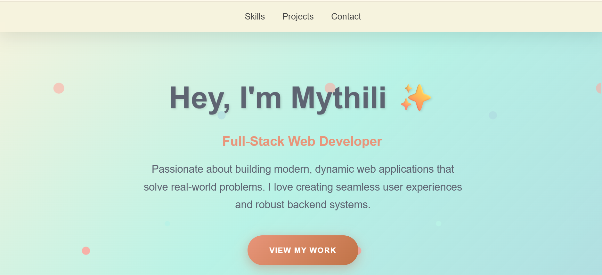

This is my personal portfolio website that showcases my **skills, projects, and contact details** in a clean and modern design.

## 🚀 Features
- Animated **hero section** with typing effect  
- **Skills section** with categorized cards  
- **Projects section** with interactive hover video previews  
- **Contact section** with quick links to email, GitHub, and LinkedIn  
- Fully **responsive design** for desktop and mobile  

## 🛠️ Tech Stack
- **Frontend**: HTML5, CSS3
- **Styling**: Modern CSS (gradients, flexbox, grid, animations)  
- **Tools**: Git, VS Code  
---
## 🌐 Live Demo
- https://github.com/Mythili-Velivelli/Portfolio.git
---
## 📸 Screenshots

### Welcome Page

---
## 📂 Project Structure
```
portfolio/
│── index.html       # Main HTML file
│── style.css        # Stylesheet
│── assets/          # Screenshot
└── README.md        # Documentation
```
---

✨ Made with ❤️ by **Mythili**
